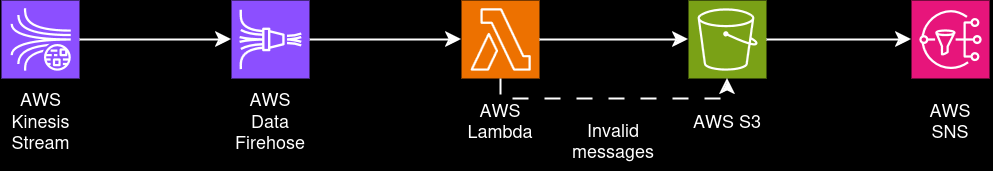

# Python Challenge

## Introduction
This is an app to process data events sent by several "Event Producers" and deliver to a "Sender" responsible for spread the processed events to subscribed clients.

## Architecture overview

To achieve a low latency solution, the AWS Kinesis Data Stream was chosen. Due to its suitability for real-time processing of streaming big data.

The Kinesis Data Stream can receive data from multiple producers (fan-in), split the records into multiple shards, a Data Firehose concurrently transforms the data using a Lambda Function before delivering it to an S3 Bucket. Then the S3 bucket notifies a SNS topic for each valid file created, spreading the data among the consumers (fan-out).

The S3 Bucket was select as the final destination of the Data Firehose due to its ability to store data persistently, enabling backfilling.

The invalid data records are stored in the same S3 Bucket, but in a different folder. This folder can be monitored to check if any producer is not working well.

## Prerequisites

### Dev environment

## Instructions

### Using the application

### Run integration tests
